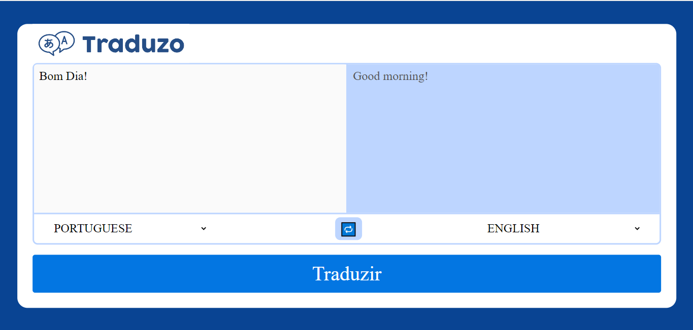

# :construction: README em construção ! :construction:
<!-- Olá, Tryber!
Esse é apenas um arquivo inicial para o README do seu projeto.
É essencial que você preencha esse documento por conta própria, ok?
Não deixe de usar nossas dicas de escrita de README de projetos, e deixe sua criatividade brilhar!
:warning: IMPORTANTE: você precisa deixar nítido:
- quais arquivos/pastas foram desenvolvidos por você; 
- quais arquivos/pastas foram desenvolvidos por outra pessoa estudante;
- quais arquivos/pastas foram desenvolvidos pela Trybe.
-->
# Esse foi um projeto construido durante o curso da Trybe

minha função era Desenvolver Uma ferramenta de tradução de textos entre vários idiomas

Nesse projeto eu utilizei python com o framework flask,
criei as Models e Controllers e fiz a conexão com o banco de dados, e fiz o html para a conexão com o back-end

# O CSS do projeto e demais configuraçoes do projeto e da autoria da Trybe!

Um exemplo de como ficou o projeto visualmente

